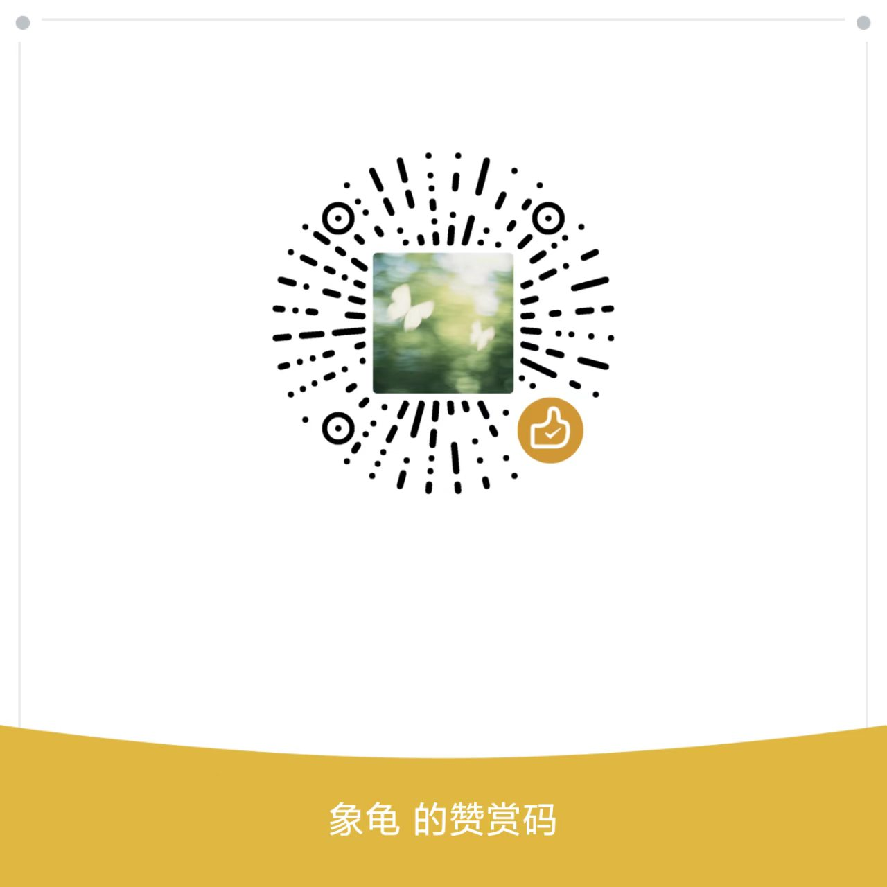

# ZZU Date — 郑州大学校园社交平台

<div align="center">


**信息发布 · 评论互动 · AI 灵魂匹配 · 三阶坦白**

</div>

---

## 目录

- [项目简介](#项目简介)
- [系统架构](#系统架构)
- [快速开始](#快速开始)
- [接口文档](#接口文档)
- [安全防护](#安全防护)
- [项目结构](#项目结构)
- [Redis Key 设计](#redis-key-设计)
- [经验系统](#经验系统)
- [匹配算法详解](#匹配算法详解)
- [前端详细说明](#前端详细说明)
- [部署指南](#部署指南)
- [开发规范](#开发规范)
- [故障排查](#故障排查)
- [更新日志](#更新日志)
- [贡献指南](#贡献指南)
- [许可证](#许可证)
- [联系方式](#联系方式)

---

## 📖 项目简介

ZZU Date 是为郑州大学学生打造的校园社交平台，采用前后端分离架构。核心功能如下：

| 功能 | 说明 |
|------|------|
| 🎓 **校园专属** | 仅限郑大邮箱注册（`@zzu.edu.cn` / `@stu.zzu.edu.cn` / `@gs.zzu.edu.cn`） |
| 💬 **信息广场** | 多分区帖子发布与评论（公共讨论区 / 校医院 / 餐厅 / 学习备考） |
| 🔥 **灵魂匹配** | 40 维画像匹配算法 + DeepSeek AI 生成评语，每周三 19:00 定时执行 |
| 🤝 **三阶坦白** | 阶段 C（封锁）→ 阶段 B（单向）→ 阶段 A（共鸣），渐进式交换联系方式 |
| ⚡ **经验系统** | 登录 +20、发帖 +20（上限 100/日）、评论 +20（上限 100/日），Redis 按来源控上限 |
| 🛡️ **多层防护** | IP + 用户级限流、邮箱五层安检、Redis + Lua 原子操作 |

### 子项目说明

| 目录 | 技术栈 | 说明 |
|------|--------|------|
| `zzudate/` | Spring Boot 3 + MyBatis-Plus + MySQL + Redis | 后端服务，提供 RESTful API |
| `zzudate-f/` | Vue 3 + Vite + Pinia + Axios | 前端 SPA 应用 |

---

## 🧭 系统架构

```
┌─────────────────────────────────────────────────┐
│                    前端 (Vue3)                    │
│         zzudate-f/  ·  Vite ·  Axios             │
└────────────────────┬────────────────────────────┘
                     │ HTTP (Authorization Header)
┌────────────────────▼────────────────────────────┐
│              后端 (Spring Boot 3)                │
│                                                  │
│  RateLimitInterceptor → LoginInterceptor          │
│         │                    │                   │
│    IP限流 + 用户限流    Token认证 + 续期          │
│         │                    │                   │
│  ┌──────┴────────────────────┴──────┐            │
│  │         Controller 层            │            │
│  │  Auth / Info / Comment / Match   │            │
│  └─────────────────────────────────┘            │
│         │              │            │            │
│  ┌──────▼──┐    ┌─────▼─────┐  ┌──▼───────┐    │
│  │  MySQL  │    │   Redis   │  │ DeepSeek │     │
│  │  数据   │    │ Token/限流 │  │  AI评语  │     │
│  └─────────┘    └───────────┘  └──────────┘    │
└─────────────────────────────────────────────────┘
```

拦截器执行链：`RateLimitInterceptor（限流） → LoginInterceptor（认证） → Controller`

---

## 🚀 快速开始

### 环境要求

| 环境 | 版本 | 必须 |
|------|------|:----:|
| JDK | 17+ | ✅ |
| MySQL | 8.0+ | ✅ |
| Redis | 7.0+ | ✅ |
| Maven | 3.6+ | ✅（后端） |
| Node.js | 18+ | ✅（前端） |

### 1. 克隆项目

```bash
git clone <repo-url>
cd zzudate-all
```

### 2. 初始化数据库

```bash
mysql -u root -p < zzudate/zzudate.sql
```

建表后 MyBatis-Plus 会自动完成实体 ↔ 表的字段映射。

### 3. 启动 Redis

```bash
# Linux / macOS
redis-server

# Windows
# 下载 Redis for Windows: https://github.com/microsoftarchive/redis/releases
# 或使用 WSL: wsl redis-server
```

### 4. 配置后端

创建 `zzudate/src/main/resources/application-local.properties`：

```properties
# 数据库
spring.datasource.url=jdbc:mysql://localhost:3306/zzudate?serverTimezone=GMT%2B8&characterEncoding=utf-8
spring.datasource.username=root
spring.datasource.password=your_password

# Redis
spring.data.redis.host=localhost
spring.data.redis.port=6379

# 邮件（根据实际邮箱服务商填写）
spring.mail.host=smtp.163.com
spring.mail.port=465
spring.mail.username=your_email@163.com
spring.mail.password=your_smtp_password
spring.mail.properties.mail.smtp.ssl.enable=true

# DeepSeek API
deepseek.api-key=your_api_key
```

> ⚠️ 敏感信息请勿提交到 Git！建议将 `application-local.properties` 加入 `.gitignore`。

### 5. 启动后端

```bash
cd zzudate
./mvnw spring-boot:run -Dspring-boot.run.profiles=local

# 或打包运行
./mvnw clean package -DskipTests
java -jar target/zzudate-0.0.1-SNAPSHOT.jar --spring.profiles.active=local
```

后端启动后访问：`http://localhost:8080`

### 6. 启动前端

```bash
cd zzudate-f
npm install
npm run dev
```

前端启动后访问：`http://localhost:5173`（Vite 默认端口）

---

## 📚 接口文档

> 统一响应格式：`{ "code": 200, "message": "操作成功", "data": {} }`
>
> 需登录接口在 Header 中携带：`Authorization: <accessToken>`

### 认证接口 — `/auth`

| 接口 | 方法 | 说明 | 登录 |
|------|------|------|:----:|
| `/auth/getemailcode` | POST | 获取邮箱验证码 | ❌ |
| `/auth/emailloginautoregister` | POST | 邮箱登录 / 自动注册 | ❌ |
| `/auth/logout` | POST | 安全退出 | ✅ |

<details>
<summary>请求示例</summary>

```bash
# 获取验证码
curl -X POST "http://localhost:8080/auth/getemailcode" \
  -H "Content-Type: application/x-www-form-urlencoded" \
  -d "email=12345678@stu.zzu.edu.cn"

# 登录 / 注册
curl -X POST "http://localhost:8080/auth/emailloginautoregister" \
  -H "Content-Type: application/x-www-form-urlencoded" \
  -d "email=12345678@stu.zzu.edu.cn" \
  -d "emailCode=123456"

# 响应
{
  "code": 200,
  "message": "登录成功",
  "data": {
    "accessToken": "uuid-token",
    "userId": "1",
    "email": "12345678@stu.zzu.edu.cn",
    "name": "张三",
    "exp": 60
  }
}
```
</details>

### 帖子接口 — `/Info`

| 接口 | 方法 | 说明 | 登录 |
|------|------|------|:----:|
| `/Info/saveInfo` | POST | 发布帖子 | ✅ |
| `/Info/updateInfo` | POST | 更新帖子（仅作者） | ✅ |
| `/Info/deleteInfo` | POST | 删除帖子（仅作者） | ✅ |
| `/Info/list` | GET | 获取全部帖子 | ✅ |
| `/Info/listByCategory` | GET | 按分类获取帖子 | ✅ |

分类：`公共讨论区` · `校医院` · `餐厅` · `学习备考`

<details>
<summary>请求示例</summary>

```bash
curl -X POST "http://localhost:8080/Info/saveInfo" \
  -H "Authorization: your_token" \
  -H "Content-Type: application/json" \
  -d '{"title":"考研数学交流","content":"有没有一起复习高数的？","category":"学习备考"}'
```
</details>

### 评论接口 — `/Comment`

| 接口 | 方法 | 说明 | 登录 |
|------|------|------|:----:|
| `/Comment/save` | POST | 发表评论 | ✅ |
| `/Comment/delete` | POST | 删除评论（仅本人） | ✅ |
| `/Comment/listByInfoId` | GET | 查看帖子评论 | ✅ |

### 匹配接口 — `/match`

| 接口 | 方法 | 说明 | 登录 |
|------|------|------|:----:|
| `/match/getuserinfo` | GET | 获取当前用户信息 | ✅ |
| `/match/savebaseinfo` | POST | 保存基础信息 | ✅ |
| `/match/saveuserinfo` | POST | 保存灵魂问卷答案 | ✅ |
| `/match/getmatchresult` | POST | 获取匹配结果 | ✅ |
| `/match/shownumber` | POST | 坦白联系方式 | ✅ |

<details>
<summary>请求示例</summary>

```bash
# 获取用户信息
curl -X GET "http://localhost:8080/match/getuserinfo" \
  -H "Authorization: your_token"

# 保存基础信息
curl -X POST "http://localhost:8080/match/savebaseinfo" \
  -H "Authorization: your_token" \
  -H "Content-Type: application/json" \
  -d '{
    "name":"张三","gender":true,"height":"175","age":"21",
    "college":"计算机学院","campus":"主校区","grade":2,
    "choose":"0","friendChoose":"顺其自然",
    "number":"13800138000",
    "ageRequirementMin":"20","ageRequirementMax":"23",
    "heightRequirementMin":"160","heightRequirementMax":"180",
    "campusRequirement":["主校区","南校区"]
  }'
```
</details>

### 基础信息接口 — `/BaseInfo`

| 接口 | 方法 | 说明 | 登录 |
|------|------|------|:----:|
| `/BaseInfo/savaInfo` | POST | 新增信息 | ✅ |
| `/BaseInfo/updateInfo` | POST | 更新信息（仅作者） | ✅ |
| `/BaseInfo/deleteInfo` | POST | 删除信息（仅作者） | ✅ |

---

## 🛡️ 安全防护

### 限流规则

| 级别 | 规则 | 适用范围 | TTL |
|------|------|---------|-----|
| IP 全局 | 15 次/分钟 | 所有接口 | 60s |
| 用户发帖 | 1 篇/分钟 | `POST /Info/saveInfo` | 60s |
| 用户评论 | 5 条/分钟 | `POST /Comment/save` | 60s |

> 限流拦截器在登录拦截器之前执行。用户级限流通过自行解析 Redis Token 获取 userId，不依赖 `ThreadLocal`。

### 邮箱验证五层防护

| 层级 | 检查项 | 限制 |
|:----:|--------|------|
| 1 | 全局熔断 | 每秒最多 5 封邮件 |
| 2 | IP 黑名单 | 命中即拒绝（24h 解封） |
| 3 | 邮箱频率 | 同一邮箱 60 秒内仅 1 次 |
| 4 | IP 日限额 | 每日 15 次，超额自动拉黑 |
| 5 | 分布式锁 | 同一邮箱并发请求串行化 |

使用 Redis + Lua 脚本保证以上操作原子性。

### Token 机制

```
登录 → UUID Token → Redis（TTL 48h，访问即续期）
请求 → Header: Authorization → LoginInterceptor 校验
通过 → CurrentUser（ThreadLocal） → 业务获取当前用户
登出 → 删除 Redis Key → 立即失效
```

### 拦截器排除路径

| 路径 | 说明 |
|------|------|
| `/auth/**` | 登录、注册、验证码 |
| `/error` | 错误页面 |
| `/static/**` | 静态资源 |

---

## 📦 项目结构

```
zzudate-all/
├── README.md                                   # 项目总文档
│
├── zzudate/                                    # 后端 Spring Boot
│   ├── src/main/java/org/example/zzudate/
│   │   ├── ZzudateApplication.java             # 启动类
│   │   ├── Result.java                         # 统一响应 Result<T>
│   │   ├── EmailService.java                   # 邮件发送
│   │   ├── GenerateEmailCode.java              # 6 位验证码
│   │   ├── config/
│   │   │   └── WebConfig.java                  # 拦截器注册
│   │   ├── controller/
│   │   │   ├── AuthController.java             # /auth 认证
│   │   │   ├── InfoController.java             # /Info 帖子
│   │   │   ├── BaseInfoController.java         # /BaseInfo 基础信息
│   │   │   ├── CommentController.java          # /Comment 评论
│   │   │   └── MatchController.java            # /match 匹配
│   │   ├── dto/
│   │   │   ├── UserBaseInfoDto.java            # 基础信息 DTO
│   │   │   └── UserSoulInfoDto.java            # 灵魂问卷 DTO
│   │   ├── entity/
│   │   │   ├── User.java                       # 用户实体
│   │   │   ├── Info.java                       # 帖子实体
│   │   │   ├── Comment.java                    # 评论实体
│   │   │   └── MatchResult.java                # 匹配结果实体
│   │   ├── mapper/                             # MyBatis-Plus Mapper
│   │   ├── service/
│   │   │   ├── WeeklyMatchService.java         # 周三 19:00 定时匹配
│   │   │   ├── Match.java                      # 40 维匹配算法
│   │   │   ├── DeepSeekService.java            # AI 评语异步生成
│   │   │   └── UserServiceImpl.java            # 用户服务（含经验系统）
│   │   ├── utils/
│   │   │   ├── CurrentUser.java                # ThreadLocal 当前用户
│   │   │   ├── LoginInterceptor.java           # 登录拦截器
│   │   │   └── RateLimitInterceptor.java       # 限流拦截器
│   │   └── vo/                                 # 响应 VO
│   ├── src/main/resources/
│   │   ├── application.properties
│   │   └── lua/                                # Redis Lua 脚本
│   └── pom.xml
│
├── zzudate-f/                                  # 前端 Vue3 + Vite
│   ├── src/
│   │   ├── views/                              # 页面组件
│   │   │   ├── welcome.vue                     # 欢迎/登录页
│   │   │   ├── Home.vue                        # 首页
│   │   │   ├── Community.vue                   # 信息广场
│   │   │   ├── CommunityLogin.vue              # 登录后入口
│   │   │   ├── Info.vue                        # 个人信息填写
│   │   │   ├── Question.vue                    # 灵魂问卷
│   │   │   ├── Result.vue                      # 匹配结果
│   │   │   └── Profile.vue                     # 个人中心
│   │   ├── router/index.js                     # 路由配置
│   │   ├── utils/
│   │   │   ├── request.js                      # Axios 封装
│   │   │   └── userSync.js                     # 用户数据同步
│   │   └── stores/                             # Pinia 状态管理
│   ├── package.json
│   └── vite.config.js
│
└── zzudate.sql                                 # 数据库初始化脚本（在 zzudate/ 内）
```

---

## 🔑 Redis Key 设计

| Key | 说明 | TTL |
|-----|------|-----|
| `login:accessToken:{token}` | Token → UserId | 48h |
| `login:code:{email}` | 邮箱验证码 | 5min |
| `login:emailcode:limit:{email}` | 邮箱发送频率 | 60s |
| `login:blacklist:{ip}` | IP 黑名单 | 24h |
| `login:emailcode:daily_limit:{date}:{ip}` | IP 日发送计数 | 24h |
| `rate:ip:{ip}` | IP 限流计数 | 60s |
| `rate:user:{userId}:post` | 发帖限流 | 60s |
| `rate:user:{userId}:comment` | 评论限流 | 60s |
| `daily:exp:{userId}:{source}:{date}` | 每日经验计数（按来源） | 24h |
| `limit:all_email_send:{timestamp}` | 全局邮件熔断 | 1s |
| `lock:getcode:{email}` | 验证码分布式锁 | 10s |

---

## ⚡ 经验系统

| 行为 | 单次 EXP | 每日上限 | 来源标识 |
|------|:-------:|:-------:|---------|
| 每日登录 | +20 | 20 | `login` |
| 发布帖子 | +20 | 100 | `post` |
| 发表评论 | +20 | 100 | `comment` |

- 经验值通过 `addExpWithDailyCap()` 方法写入，Redis 按 `来源 + 日期` 独立计数
- 前端通过 `localStorage` 缓存，登录/发帖/评论成功后同步更新

---

## 🎯 匹配算法详解

### 40维灵魂画像

问卷分为4个维度，每个维度10道题（实际编码按Q1-Q40处理）：

| 维度 | 题号范围 | 权重/题 | 总分占比 | 说明 |
|------|---------|:-------:|:-------:|------|
| 💰 **物质底色** | Q1-Q8 | 0.025 | 20% | 消费观、生活习惯 |
| 💕 **精神依恋** | Q9-Q18 | 0.025 | 20% | 情感观念、价值观 |
| 🌟 **生活节律** | Q19-Q28 | 0.015 | 15% | 作息时间、兴趣爱好 |
| 🎭 **灵魂底线** | Q29-Q40 | 0.0333 | 40% | 原则底线、核心价值观 |

### 匹配流程

```
每周三 19:00 定时任务触发
         ↓
清空上周匹配结果
         ↓
拉取所有已填写问卷用户
         ↓
预解析画像JSON（缓存优化）
         ↓
计算所有合法候选对分数
         ↓
五层过滤校验
   ├─ 性别倾向双向校验
   ├─ 年龄要求双向校验
   ├─ 身高要求双向校验
   ├─ 校区要求双向校验
   └─ 交友意向校验
         ↓
同学院加分（+2%，封顶100%）
         ↓
按分数降序 → 贪心算法配对
         ↓
过滤低分对（<30分不配对）
         ↓
批量写入数据库
         ↓
异步调用DeepSeek生成AI评语
```

### 匹配质量分级

| 分数范围 | 等级 | 描述 |
|---------|:----:|------|
| 80-100 | ⭐⭐⭐⭐⭐ | 灵魂伴侣，高度契合 |
| 60-79 | ⭐⭐⭐⭐ | 非常匹配，三观相近 |
| 40-59 | ⭐⭐⭐ | 中等匹配，有共鸣有差异 |
| 30-39 | ⭐⭐ | 基础匹配，需要磨合 |
| <30 | ❌ | 不匹配，不生成配对 |

### 特殊机制

- **同学院加分**：匹配双方同学院额外+2%分数
- **双向校验**：所有偏好要求必须双向满足才配对
- **默认异性匹配**：未设置性别偏好时，默认匹配异性
- **交友意向宽松匹配**："顺其自然拓宽社交"可与任意意向匹配

---

## 🎨 前端详细说明

### 技术栈

- **框架**：Vue 3 (Composition API + `<script setup>`)
- **构建工具**：Vite 8
- **路由**：Vue Router 4（History 模式）
- **状态管理**：Pinia 3
- **HTTP客户端**：Axios（开发环境通过 Vite 代理 `/api` → `http://localhost:8080`）
- **UI组件**：无第三方UI库，自定义样式
- **头像**：DiceBear Avatars（根据 userId 随机生成）

### 页面路由

| 路由 | 页面组件 | 说明 | 认证要求 |
|------|---------|------|:--------:|
| `/welcome` | `Welcome.vue` | 欢迎页/登录注册 | ❌ |
| `/community/login` | `CommunityLogin.vue` | 社区登录入口 | ❌ |
| `/home` | `Home.vue` | 首页（匹配状态） | ✅ |
| `/community` | `Community.vue` | 信息广场 | ✅ |
| `/info` | `Info.vue` | 个人信息填写 | ✅ |
| `/question` | `Question.vue` | 灵魂问卷（40题） | ✅ |
| `/result` | `Result.vue` | 匹配结果展示 | ✅ |
| `/profile` | `Profile.vue` | 个人中心 | ✅ |

### 路由守卫

- **白名单**：`/welcome`、`/community/login` 无需登录
- **其他页面**：需 Token 校验，未登录重定向到 `/welcome`
- **社区子页面**：未登录重定向到 `/community/login`

### 核心功能模块

#### 1. 认证模块 (`utils/request.js`)
- Axios 请求/响应拦截器
- 自动携带 Token
- 401 自动跳转登录页
- 统一错误处理

#### 2. 用户数据同步 (`utils/userSync.js`)
- 本地缓存用户画像数据
- 减少重复请求
- 优化用户体验

#### 3. 状态管理 (`stores/`)
- 用户信息 Store
- 匹配结果 Store
- 帖子列表 Store

---

## 🚀 部署指南

### 后端部署

**方式一：Jar包部署**

```bash
# 1. 打包
cd zzudate
./mvnw clean package -DskipTests

# 2. 上传jar包到服务器
scp target/zzudate-0.0.1-SNAPSHOT.jar user@your-server:/app/

# 3. 创建生产配置 application-prod.properties

# 4. 启动服务
java -jar zzudate-0.0.1-SNAPSHOT.jar --spring.profiles.active=prod
```

**方式二：Docker部署**

```dockerfile
# Dockerfile（置于 zzudate/ 目录）
FROM openjdk:17-jdk-slim
COPY target/zzudate-0.0.1-SNAPSHOT.jar app.jar
ENTRYPOINT ["java","-jar","/app.jar"]
```

```bash
docker build -t zzudate:latest .
docker run -d \
  --name zzudate \
  -p 8080:8080 \
  -v /path/to/prod.properties:/app/application-prod.properties \
  zzudate:latest \
  --spring.profiles.active=prod
```

### 前端部署

```bash
# 1. 构建生产版本
cd zzudate-f
npm install
npm run build

# 2. 将 dist/ 目录部署到 Web 服务器
```

**Nginx 配置示例：**

```nginx
server {
    listen 80;
    server_name your-domain.com;
    
    root /var/www/zzudate/dist;
    index index.html;
    
    location / {
        try_files $uri $uri/ /index.html;
    }
    
    location /api {
        proxy_pass http://localhost:8080;
        proxy_set_header Host $host;
        proxy_set_header X-Real-IP $remote_addr;
    }
}
```

### 数据库部署

```bash
# 1. 导入SQL脚本
mysql -u root -p < zzudate/zzudate.sql

# 2. 创建生产环境用户并授权
CREATE USER 'zzudate'@'localhost' IDENTIFIED BY 'strong_password';
GRANT SELECT, INSERT, UPDATE, DELETE ON zzudate.* TO 'zzudate'@'localhost';
FLUSH PRIVILEGES;
```

### Redis部署

```bash
# /etc/redis/redis.conf 生产环境配置
bind 127.0.0.1
requirepass your_redis_password
maxmemory 256mb
maxmemory-policy allkeys-lru

systemctl restart redis
```

### 性能优化建议

- **后端**：开启Gzip压缩、配置连接池、JVM调优
- **前端**：启用CDN、开启Gzip、配置缓存策略
- **数据库**：添加索引、配置连接池、开启查询缓存
- **Redis**：配置最大内存、设置淘汰策略

---

## 📝 开发规范

### 代码规范

- **返回格式** — 统一使用 `Result<T>` 封装：`Result.success(data)` / `Result.error("msg")`
- **当前用户** — 通过 `CurrentUser.getUserId()` 获取，`ThreadLocal` 自动清理
- **日志输出** — 使用 Slf4j `log.info()` / `log.error()`，禁止 `System.out.println`
- **实体类** — 使用 Lombok `@Data`，字段加 `private`，List 字段加 `@TableField(typeHandler = JacksonTypeHandler.class)`
- **敏感配置** — 密码/密钥写入 `application-local.properties`，不提交版本库

### Git 提交格式

```
feat: 新功能
fix: 修复 Bug
docs: 文档更新
refactor: 重构
style: 代码格式
test: 测试
chore: 构建/工具
```

### 分支管理

- `main` — 生产环境分支
- `dev` — 开发分支
- `feature/*` — 功能分支
- `hotfix/*` — 紧急修复分支

---

## 🐛 故障排查

### 常见问题

| 问题 | 原因 / 解决 |
|------|------------|
| 验证码收不到 | 检查是否触发五层防护，查看日志关键词 `全局熔断` / `IP超额` |
| 请求返回 429 | IP 或用户行为触发限流，等待 1 分钟后重试 |
| 请求返回 401 | Token 过期或已登出，重新登录即可 |
| `campusRequirement` 返回 null | JacksonTypeHandler 未在查询时生效，确保 `@TableName(autoResultMap = true)` |
| 数据库字段映射报错 | 检查实体类字段名与数据库列名是否匹配，必要时加 `@TableField` |
| 匹配结果为空 | 检查是否完成灵魂问卷，每周三19:00生成新匹配 |
| AI评语未生成 | 检查DeepSeek API配置，查看异步任务日志 |

### 日志查看

```bash
# 后端 — 开发环境
tail -f zzudate/logs/spring.log

# 后端 — 生产环境（systemd）
journalctl -u zzudate -f

# 后端 — Docker容器
docker logs -f zzudate
```

---

## 📅 更新日志

### v1.0.0 (2026-05-21)

初始版本发布，包含邮箱注册登录、信息广场、40维灵魂匹配、AI评语、三阶坦白、经验系统、多层安全防护等核心功能。

---

## 🤝 贡献指南

欢迎贡献代码、提出建议或反馈问题！

### 如何贡献

1. Fork 本仓库
2. 创建功能分支 (`git checkout -b feature/AmazingFeature`)
3. 提交更改 (`git commit -m 'feat: Add some AmazingFeature'`)
4. 推送到分支 (`git push origin feature/AmazingFeature`)
5. 提交 Pull Request

### 报告问题

请在 GitHub Issues 中提交问题，包含以下信息：
- 问题描述
- 复现步骤
- 预期行为
- 实际行为
- 截图（如适用）

---

## 📄 许可证

MIT License

---

## 📞 联系方式

- **邮箱**：zzudate@163.com

---

## ☕ 赞赏支持

如果这个项目对你有帮助，欢迎请开发者喝杯咖啡～

<div align="center">



</div>

<br>

<div align="center">

Made with ❤️ by ZZU Students

</div>
